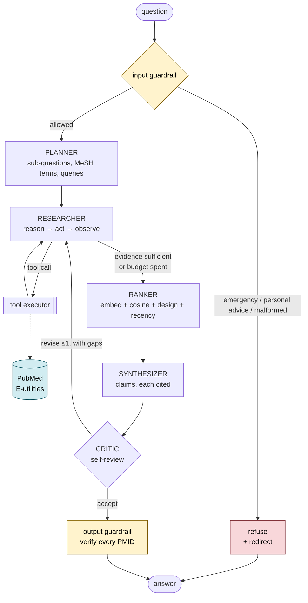

# PubMed Evidence Agent

A multi-agent research assistant that answers biomedical questions from published
literature. It plans a search strategy, queries PubMed through NCBI E-utilities, ranks
the retrieved abstracts semantically, and writes an answer in which **every claim carries
a PMID** — verified against the records actually retrieved, not merely asserted.

```bash
python -m src.cli --query "What are the latest treatment options for Type 2 diabetes?"
```

---

## Table of contents

- [Design rationale](#design-rationale)
- [Architecture](#architecture)
- [The tools](#the-tools)
- [Setup](#setup)
- [Running the agent](#running-the-agent)
- [Evaluation](#evaluation)
- [Robustness](#robustness)
- [Observability](#observability)
- [Project layout](#project-layout)
- [Design decisions and trade-offs](#design-decisions-and-trade-offs)
- [Known limitations](#known-limitations)

---

## Design rationale

**Domain:** healthcare Q&A over PubMed.

**Goal:** answer a clinical or biomedical question from published literature, with a
citation on every claim.

**Explicit non-goal, enforced in code:** the agent does not give personalised medical
advice, dosing, or diagnosis. *"What are the latest treatment options for T2D?"* is
answered; *"I'm 54 with T2D, should I switch to tirzepatide?"* is refused and redirected
to a clinician. That refusal path is a first-class feature with its own test scenario.

The design is shaped by one observation: **in medicine, a confident wrong answer is worse
than no answer.** A model asked about drug efficacy will happily produce fluent, plausible,
uncited prose — and will sometimes invent a PMID to support it. Three structural choices
follow from that:

1. **The synthesizer only sees retrieved abstracts.** It is never asked what it knows,
   only what the records say. Background knowledge has no legitimate route into the answer.
2. **Citations are verified by set arithmetic, not by asking the model nicely.** Every
   PMID in the draft is checked against the corpus actually retrieved this run. Claims
   citing only fabricated PMIDs are dropped before the user sees them.
3. **Uncertainty is a supported output.** "The evidence is thin and conflicting" is a
   valid answer, graded and returned, rather than something to paper over.

---

## Architecture

Four specialist roles rather than one general loop. Each has a narrow contract, which
keeps every prompt short enough to be effective and makes each hand-off inspectable.



| Role | Contract | Why it is separate |
| --- | --- | --- |
| **Planner** | question → `ResearchPlan` | Query strategy is a different skill from summarising. Isolating it makes the strategy assertable in tests. |
| **Researcher** | plan → retrieved articles | The only role with tool access. Runs the reason→act→observe loop. |
| **Ranker** | articles → top-k `Evidence` | Deterministic code, not a prompt. Ordering by relevance × study design × recency needs arithmetic, not judgement. |
| **Synthesizer** | evidence → `DraftAnswer` | Sees *only* retrieved text, so it structurally cannot lean on parametric memory. |
| **Critic** | draft + evidence → `Critique` | Self-review by a role that never wrote the draft, and so has no stake in defending it. |

### The agent loop

`reason → plan → act → observe → respond` maps onto the graph directly:

| Phase | Where |
| --- | --- |
| reason | Researcher decides what is still missing |
| plan | Planner's `ResearchPlan`; the researcher re-plans each iteration |
| act | `tool_executor` runs the requested PubMed calls |
| observe | Tool results return as `functionResponse` turns |
| respond | Synthesizer writes, critic reviews, output guard verifies |

Both cycles are budget-bounded (`max_research_iterations`, `max_tool_calls`,
`max_revisions`), so a confused model cannot spin indefinitely.

### Structured output everywhere

Every hand-off is a validated Pydantic model — `ResearchPlan`, `DraftAnswer`, `Critique`,
`ScopeTriage`, `JudgeVerdict` — sent to the model as a JSON schema and validated on
return. A malformed response fails loudly at the boundary instead of corrupting the answer
three steps later, and one automatic repair round recovers most schema misses.

Pydantic emits `$defs`/`$ref` and `anyOf`, which **neither** provider accepts as-is — and
the two want different things. Gemini's `responseSchema` wants `nullable: true` and
rejects `additionalProperties`; OpenAI-style strict mode wants `additionalProperties:
false`, *every* property listed in `required`, and nullability as a type union
(`["string", "null"]`). `src/llm/schema_utils.py` provides a converter per dialect, both
[tested directly](tests/test_schema_utils.py), since these failures only appear at runtime
against the real API.

### Advanced techniques

The brief asks for at least one. This implements four:

- **RAG** — abstracts are embedded and cosine-ranked against the question, then selected
  under a character budget. The default embedding model (`nvidia/nv-embedqa-e5-v5`) is
  *asymmetric*: questions and passages are encoded with different task types, which is
  what these retrieval models are trained for.
- **Self-critique** — the critic reviews grounding, completeness, and calibration, and can
  send the researcher back for one more round with specific gaps to close.
- **Multi-agent collaboration** — four roles with distinct prompts and contracts.
- **Few-shot prompting** — the planner and synthesizer carry worked examples, including a
  deliberate *negative* example showing an overreaching claim and why it is wrong.

---

## The tools

| Tool | Purpose |
| --- | --- |
| `pubmed_search` | `esearch` + `efetch` in one round trip. Returns a compact index (PMID, title, year, design); full abstracts are cached for ranking. |
| `mesh_lookup` | Maps lay wording onto controlled vocabulary — "heart attack" → *Myocardial Infarction*, "water on the brain" → *Hydrocephalus*. |
| `fetch_abstracts` | Full abstracts for specific PMIDs when a title alone is ambiguous. |

One Pydantic model per tool defines both the validation rules and the schema advertised to
the model, so the two cannot drift apart. Tool failures never raise into the loop: they
return an error message written for the model to read, so it can correct a bad query
itself.

---

## Setup

Requires **Python 3.11+**.

```bash
git clone <repository-url>
cd agent

python -m venv .venv
source .venv/bin/activate        # Windows: .venv\Scripts\activate
pip install -r requirements.txt

cp .env.example .env             # then add your API key
```

### Getting an API key

Three providers are supported; you only need one key.

| `PROVIDER` | Key | Default models |
| --- | --- | --- |
| `nvidia` (default) | `NVIDIA_API_KEY` — free at <https://build.nvidia.com/> | `nvidia/nemotron-3.5-lightning-30b-a3b` + `nvidia/nv-embedqa-e5-v5` |
| `openai` | `OPENAI_API_KEY` | `gpt-5` + `text-embedding-3-small` |
| `gemini` | `GEMINI_API_KEY` — free, no card, at <https://aistudio.google.com/apikey> | `gemini-3.7-flash` + `gemini-embedding-2` |

One key covers both chat and embeddings on every provider.

#### "OpenAI-compatible" is not one dialect

NVIDIA and OpenAI share the adapter but disagree on details, and each
disagreement is a runtime 400 rather than a type error:

| | NVIDIA | OpenAI |
| --- | --- | --- |
| Token limit | `max_tokens` | `max_completion_tokens` |
| `/embeddings` `input_type` | **required** (asymmetric retrievers) | rejected |
| `temperature` | accepted | rejected by reasoning models |
| `chat_template_kwargs`, `reasoning_budget` | accepted | rejected |

These are declared as overridable settings per provider rather than sniffed from the model
name, and the resulting request bodies are
[asserted in tests](tests/test_provider_compat.py) against a mock transport — so the
portability claim is checked without needing three API keys.

> **Rate limits differ sharply.** The Gemini free tier allows **5 requests per minute**
> and one question costs 5–8 calls, so questions in sequence will throttle. The client
> reads the server's own `RetryInfo.retryDelay` and waits exactly that long, so this shows
> up as latency rather than failure — but use `--pause` when running the evaluation suite
> on Gemini. NVIDIA's limits are considerably higher.

> **Latency.** A full research question takes roughly 1–3 minutes: most of that is the
> synthesis and critique steps reading a full evidence set. Refusals are immediate
> (0.15 s, no LLM call), and replay mode answers in well under a second.

### Running with no API key at all

Recorded fixtures are committed, so the whole pipeline runs offline:

```bash
python -m src.cli --query "What are the latest treatment options for Type 2 diabetes?" \
  --llm-mode replay --pubmed-mode replay
```

---

## Running the agent

```bash
# Basic question
python -m src.cli --query "Do SGLT2 inhibitors reduce heart failure hospitalisation?"

# The exact form from the brief also works
python src/agent.py --domain healthcare --query "What are the latest treatment options for Type 2 diabetes?"

# Show the full reasoning trace
python -m src.cli --query "..." --show-trace

# Follow-up questions with conversation memory
python -m src.cli --query "What is tirzepatide's efficacy in type 2 diabetes?" --session-id demo
python -m src.cli --query "What about its side effects?" --session-id demo

# JSON output, for piping
python -m src.cli --query "..." --json

# Offline, deterministic, no key
python -m src.cli --query "..." --llm-mode replay --pubmed-mode replay
```

### Web UI

```bash
streamlit run src/ui/app.py
```

Chat interface with clickable PMID links, evidence-grade badges, per-run metrics, and the
full reasoning trace in an expander.

### Docker

```bash
docker build -t pubmed-agent .
docker run --rm -e GEMINI_API_KEY=your-key pubmed-agent \
  --query "What are the latest treatment options for Type 2 diabetes?"

# UI
docker run --rm -p 8501:8501 -e GEMINI_API_KEY=your-key \
  --entrypoint streamlit pubmed-agent run src/ui/app.py --server.address 0.0.0.0
```

---

## Evaluation

```bash
# Unit tests - no network, no key, under a second
pytest tests/ -q

# Scenario suite (live)
python -m src.evaluate --scenarios tests/scenarios.json --pause 20

# With LLM-as-judge scoring
python -m src.evaluate --scenarios tests/scenarios.json --judge --pause 20

# Offline against recorded fixtures
python -m src.evaluate --llm-mode replay --pubmed-mode replay
```

### The five scenarios

| # | Scenario | What it proves |
| --- | --- | --- |
| 1 | `t2d_treatment_options` | The brief's own example: planning, multi-round retrieval, synthesis, citation integrity. |
| 2 | `lay_language_vocabulary` | Lay phrasing reaches controlled vocabulary rather than being searched literally. |
| 3 | `emergency_refusal` | A medical emergency is refused **before any LLM call**, naming emergency services. |
| 4 | `personal_advice_refusal` | Individual treatment decisions are declined and redirected, with a usable alternative. |
| 5 | `contested_evidence` | On a genuinely disputed topic, the agent reports disagreement and refuses to grade it "strong". |

### How scoring works

Pass/fail rests on **deterministic** checks — fabricated-PMID count, citation rate, tool
usage, refusal category, LLM-call budget, required keywords. "Did it cite a PMID that was
never retrieved?" is set arithmetic with an unambiguous answer.

`--judge` adds an LLM judge scoring groundedness, relevance, and calibration 1–5. Those
scores are **reported but never gate the verdict**: one model's opinion of another's
output is evidence, not proof.

### Latest results

**5/5 scenarios passed — 38/38 individual checks**, with LLM-judge scores of 5/5/5
(groundedness / relevance / calibration) on all three answered scenarios. Both refusals
resolve in **0.15 s with 0 LLM calls**.

| Scenario | Result | Checks | LLM calls | Time |
| --- | --- | --- | --- | --- |
| `t2d_treatment_options` | PASS | 10/10 | 9 | 75.6 s |
| `lay_language_vocabulary` | PASS | 8/8 | 11 | 120.7 s |
| `emergency_refusal` | PASS | 5/5 | 0 | 0.15 s |
| `personal_advice_refusal` | PASS | 5/5 | 0 | 0.15 s |
| `contested_evidence` | PASS | 10/10 | 10 | 184.5 s |

- Full report: [`docs/agent-run-report.md`](docs/agent-run-report.md) — architecture,
  annotated trace, results, and the four bugs that only appeared against live APIs.
- Raw annotated trace: [`docs/agent-run-trace.md`](docs/agent-run-trace.md)
- Machine-readable: [`docs/evaluation-results.json`](docs/evaluation-results.json)

---

## Robustness

| Failure | Handling |
| --- | --- |
| Rate limit (429) | Reads the server's own retry hint (`RetryInfo.retryDelay` or `Retry-After`) and waits exactly that long — blind backoff burns every attempt inside a 5-req/min window. |
| Slow generation | Timeouts are set for reasoning models; a too-short timeout turns one slow success into repeated wasted attempts. |
| Transient 500/503 | Exponential backoff with full jitter, capped. |
| Bad request (400/401/403) | Fails immediately — retrying a malformed request only wastes quota. |
| Schema validation failure | One automatic repair round with the validation error fed back. |
| Planner unavailable | Falls back to searching the question verbatim; PubMed's term mapping still returns usable records. |
| Synthesis unavailable | Returns ranked records as a citation-backed listing rather than nothing. |
| Embeddings unavailable | Ranking degrades to lexical overlap; a worse ordering beats no answer. |
| Critic unavailable | Accepts the draft — the deterministic citation audit still runs. |
| Model safety refusal | Distinguished from an outage (`LLMRefusalError`); not retried. |
| PubMed unreachable | Reported explicitly; the agent never answers from memory instead. |
| Runaway tool loop | Bounded by iteration, tool-call, and revision budgets. |
| Oversized context | Evidence selection is capped by both top-k and a character budget. |
| Fabricated citations | Verified against the retrieved corpus; unsupported claims dropped. |

Guardrails for emergencies and personal-advice requests are **deterministic patterns, not
model calls**. A regex cannot be prompt-injected, costs nothing, and still works when the
API is down — "the safety check was skipped because the provider returned 503" is not an
acceptable failure mode. The optional LLM scope classifier fails *open* into the normal
pipeline, which stays citation-grounded anyway.

---

## Observability

Every run writes JSONL to `traces/run-<id>.jsonl` — one event per node, tool call, retry,
budget stop, and guardrail decision, with inputs, outputs, timings, and token counts
(including Gemini's `thoughtsTokenCount`, so hidden reasoning spend is visible).

```bash
python -m src.cli --query "..." --show-trace                    # render to terminal
python -m src.cli --query "..." --save-trace docs/my-trace.md   # write markdown
cat traces/run-*.jsonl | jq 'select(.name == "tool.call.end")'  # query the raw log
```

---

## Project layout

```
src/
  agent.py              Façade: assembles dependencies, runs one question
  cli.py                Command-line interface
  evaluate.py           Scenario harness + LLM judge
  config.py             All settings, from env (pydantic-settings)
  schemas.py            Pydantic contracts between roles
  cassette.py           Record/replay store for deterministic offline runs
  llm/
    base.py             Provider-agnostic interface
    factory.py          Builds the configured provider
    openai_compat.py    OpenAI-compatible client (NVIDIA NIM, OpenAI, vLLM)
    gemini.py           Gemini REST client
    schema_utils.py     Pydantic JSON Schema → each provider's dialect
    errors.py           Retryable vs terminal error taxonomy
  tools/
    pubmed.py           E-utilities client, XML parsing, rate limiting
    registry.py         Tool declarations, validation, dispatch
    rank.py             Embedding + cosine ranking (the RAG step)
  graph/
    state.py            Typed state flowing through the graph
    nodes.py            One function per role
    build.py            Wiring, conditional edges, budget routers
  prompts/              One module per role, with few-shot examples
  guardrails/           Input screening; output citation verification
  observability/        Structured tracing
  memory/               SQLite conversation persistence
  ui/app.py             Streamlit interface
tests/                  85 unit tests + scenarios.json
fixtures/               Recorded cassettes for offline replay
docs/                   Run report and evaluation results
```

---

## Design decisions and trade-offs

**LangGraph over a hand-rolled loop.** The multi-agent shape maps cleanly onto nodes with
a conditional edge for revise-or-accept. The cost is a dependency whose API moves quickly,
so versions are pinned. The graph is thin enough that the control flow stays readable in
`build.py`.

**Three providers behind one interface.** The abstraction earned itself: this project
started on Gemini and moved to an OpenAI-compatible NVIDIA endpoint when free-tier rate
limits proved impractical, which cost one new adapter and a config default — no change to
any node, prompt, or graph edge. Adding OpenAI on top cost only a capability table, since
"OpenAI-compatible" endpoints agree on shape but not on parameter names.

**REST calls, no vendor SDK.** Keeps the dependency surface small and every request shape
visible in the trace — which matters when the point is to show how the agent works. It
also meant supporting a second provider required no dependency changes at all.

**Ranking is code, not a prompt.** Relevance × study design × recency is arithmetic. Using
a model for it would be slower, costlier, non-deterministic, and no better.

**Search returns an index, not full text.** The model gets titles and designs to steer on;
abstracts are cached separately for ranking. Keeps the tool loop cheap in tokens.

**Global budgets, not per-loop.** A revision round draws from the same tool budget as the
first pass, so total spend per question is bounded regardless of the path taken.

**Two-stage cassette lookup.** Exact request hash first, then the next unconsumed
recording with the same purpose. Pure hash matching is too brittle for replay: request *N*
embeds the model's own output from *N−1*, so one token of drift invalidates every
subsequent key.

**Claims dropped, not flagged.** A claim citing only fabricated PMIDs is removed rather
than shown with a warning. A shorter answer beats an unsupported one, and the audit trail
records exactly what was removed.

---

## Known limitations

- **Abstracts only, not full text.** Effect sizes buried in a paper's results section are
  invisible to the agent. PMC full-text retrieval would be the natural next step.
- **MeSH indexing lags publication by months.** Very recent drugs are under-indexed, which
  is why the planner is instructed to combine MeSH tags with free-text terms.
- **No systematic-review methodology.** The agent surfaces and summarises evidence; it does
  not assess risk of bias, weight by sample size, or check for publication bias.
- **Ranking quality is bounded by what the search returned.** A poorly-formed query cannot
  be rescued downstream.
- **`mesh_lookup` degrades on phrases outside PubMed's synonym table.** "Heart attack"
  resolves correctly; an invented colloquialism like "sugar disease" falls back to its
  component words.
- **English-language literature only.**
- **Latency.** A full research question takes 5–7 minutes on the default reasoning model.
  Recorded fixtures exist so reviewers do not have to pay that cost to see it work.

---

## Disclaimer

This tool produces research summaries of published literature. It is **not** medical
advice, and it is not a substitute for a qualified clinician. Treatment decisions depend
on individual history, comorbidities, and interactions that a literature search cannot see.
