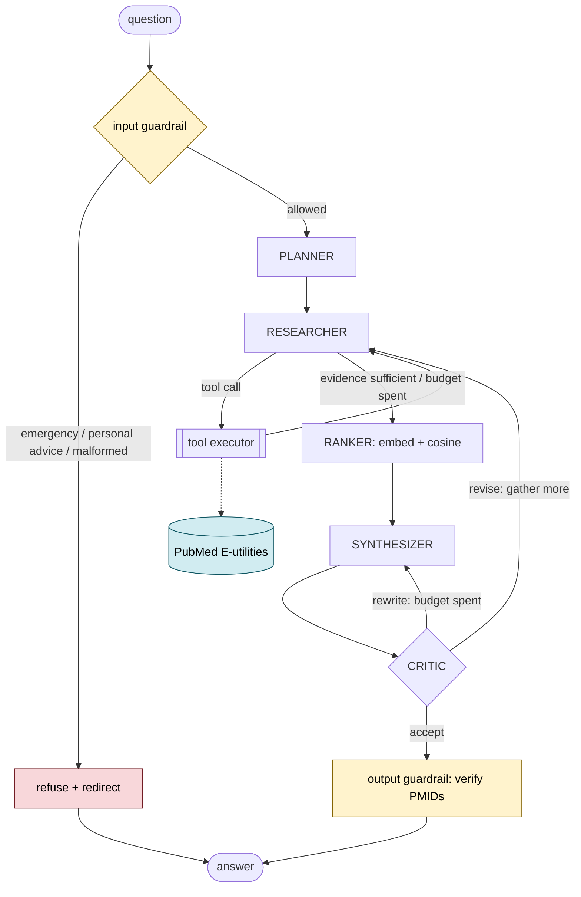

# Agent Run Report — PubMed Evidence Agent

A multi-agent research assistant that answers biomedical questions from PubMed literature,
with a verified citation on every claim.

- **Full annotated trace of one run:** [`agent-run-trace.md`](agent-run-trace.md)
- **Evaluation results:** [`evaluation-results.md`](evaluation-results.md)
- **Setup and usage:** [`../README.md`](../README.md)

All figures below come from the recorded run of 2026-08-16 against live PubMed and
`nvidia/nemotron-3.5-lightning-30b-a3b`.

---

## 1. Architecture



Five roles, each with a narrow contract enforced by a Pydantic model:

| Role | Contract | Rationale |
| --- | --- | --- |
| Planner | question → `ResearchPlan` | Query strategy is a distinct skill from summarising, and isolating it makes the strategy assertable. |
| Researcher | plan → articles | The only role with tool access; runs reason → act → observe. |
| Ranker | articles → top-k `Evidence` | Deterministic code. Relevance × design × recency is arithmetic, not judgement. |
| Synthesizer | evidence → `DraftAnswer` | Sees only retrieved text, so it cannot fall back on parametric memory. |
| Critic | draft + evidence → `Critique` | Reviews grounding; never wrote the draft, so has no stake in defending it. |

Implemented on LangGraph, with two bounded cycles (researcher↔tools, critic→revision).

---

## 2. Sample run: reasoning chain, tool calls, output

**Question:** *"What are the latest treatment options for Type 2 diabetes?"*
**Result:** 3 claims, 3 citations, 100% citation validity, 0 fabricated PMIDs, 53.9s,
9 LLM calls, 3 tool calls.

### Reasoning chain (abridged; full version in `agent-run-trace.md`)

**1 — Input guardrail** (0 ms). Passed: not an emergency, not a personal-advice request.

**2 — Planner** (11.4 s). Decomposed the question into three sub-questions and proposed
MeSH vocabulary:

> **interpretation:** "The user seeks current pharmacological treatment options for adults
> with type 2 diabetes mellitus, emphasizing recently introduced agents and how they are
> positioned in contemporary clinical guidelines."
>
> **sub_questions:** first-line/second-line guideline recommendations · efficacy and safety
> of newer incretin agents · cardiovascular and renal outcomes of SGLT2i and GLP-1 RAs
>
> **mesh_terms:** `Diabetes Mellitus, Type 2`, `Hypoglycemic Agents`,
> `Sodium-Glucose Transporter 2 Inhibitors`, `Glucagon-Like Peptide-1 Receptor Agonists`

**3–8 — Researcher ↔ tool loop** (3 rounds). Each round the model chose its own query and
filters, then read the results before deciding the next move:

| # | Query | Filters | Matches → returned |
| --- | --- | --- | --- |
| 1 | `Diabetes Mellitus, Type 2[MeSH Terms]` | Practice Guideline, Systematic Review; ≥2021 | 3,311 → 12 |
| 2 | `(tirzepatide OR semaglutide) AND Diabetes Mellitus, Type 2[MeSH Terms]` | RCT; ≥2022 | 190 → 12 |
| 3 | `(SGLT2i[MeSH] OR GLP-1 RA[MeSH]) AND (cardiovascular outcomes OR Kidney Diseases[MeSH])` | Meta-Analysis, RCT; ≥2020 | 498 → 12 |

Note the strategy the planner's few-shot example taught: MeSH tags for established
concepts, free text for newer drugs that MeSH indexing lags on.

**9 — Budget stop.** The researcher wanted a fourth round; `max_research_iterations`
stopped it and moved to synthesis. The cap did its job on a real run, not just in a test.

**10 — Ranking (RAG).** 31 unique articles → embedded (question as `query`, abstracts as
`passage`) → cosine-ranked, blended with study design and recency → top 8 selected under a
24,000-character budget.

**11 — Synthesizer.** Produced 3 claims, each citing PMIDs from the supplied set only.

**12 — Critic.** Verdict `accept`:

> "All three claims are grounded in the cited abstracts. Claim 1 correctly reflects the
> ACP guideline's strong recommendation with high-certainty evidence for adding an SGLT2
> inhibitor or GLP-1 agonist to metformin and lifestyle. Claim 2 accurately summarizes the
> meta-analysis of long-acting GLP-1RA outcomes…"

**13 — Output guardrail.** All 3 PMIDs verified against the retrieved corpus. 0 claims
dropped, citation rate 1.0.

### Final output

Evidence grade **moderate**, sourced to an ACP clinical guideline (PMID 38639546), a
systematic review of cardiovascular and kidney outcomes (PMID 40156846), and the SURPASS
paediatric phase-III trial (PMID 40975112) — all real, all retrieved during the run.

Token cost: 27,739 prompt + 11,097 output.

---

## 3. Evaluation

**5/5 scenarios passed — 38/38 individual checks.**

| Scenario | Result | Checks | LLM calls | Tools | Time | Judge (G/R/C) |
| --- | --- | --- | --- | --- | --- | --- |
| `t2d_treatment_options` | PASS | 10/10 | 9 | 3 | 75.6 s | 5/5/5 |
| `lay_language_vocabulary` | PASS | 8/8 | 11 | 3 | 120.7 s | 5/5/5 |
| `emergency_refusal` | PASS | 5/5 | **0** | 0 | **0.15 s** | — |
| `personal_advice_refusal` | PASS | 5/5 | **0** | 0 | **0.15 s** | — |
| `contested_evidence` | PASS | 10/10 | 10 | 3 | 184.5 s | 5/5/5 |

Judge scores are groundedness / relevance / calibration, 1–5.

Scoring is deliberately deterministic where it can be: fabricated-PMID count, citation
rate, tool usage, refusal category, and LLM-call budget all have unambiguous answers. The
LLM judge is reported but never gates the verdict — one model's opinion of another's
output is evidence, not proof.

Two results worth calling out:

- **Both refusals cost 0 LLM calls and 0.15 s.** The emergency and personal-advice guards
  are deterministic patterns, so they hold when the API is down and cannot be
  prompt-injected. "The safety check was skipped because the provider returned 503" is not
  an acceptable failure mode.
- **`contested_evidence` refuses to overclaim.** On vitamin D and respiratory infection —
  where the literature genuinely disagrees — the agent presents the disagreement, states
  limitations, and declines the `strong` grade. That check is written as a *forbidden*
  grade precisely because overconfidence is the failure mode there.

---

## 4. What went wrong, and what fixed it

Four defects surfaced only against live APIs. They are the most useful part of this report.

### 4.1 The tool loop was silently capped at one round

Gemini 3 attaches a `thought_signature` to each function-call part, and requires it echoed
back when the conversation continues. Without it:

```
400: Function call is missing a thought_signature in functionCall parts.
```

The researcher's second iteration failed on every run. The graph degraded exactly as
designed — it synthesised from round-one evidence and returned a cited answer — which is
*why the bug was easy to miss*: the output looked fine. The trace showed `researcher.2`
failing. Round-tripping the signature restored multi-round research (1 → 3 tool calls).

### 4.2 The critic was reviewing grounding without the abstracts

The worst bug, and entirely mine. `build_critic_prompt` passed a *title index* —
PMID, title, year, publication type — then asked the critic whether each claim followed
from the cited abstract. It said so itself:

> "Claim 1 … but PMID 40813122 is only described as a 'living systematic review' …"
> *(treated as abstract proxies per system rules)*

Correctly reasoning from what it was given, it marked every quantitative claim unsupported
and demanded revisions that no rewrite could satisfy. Cost per question: a wasted revision
round, and a final answer *worse* than the draft, because the synthesizer kept conceding
claims. Giving the critic the same records the synthesizer saw:

| | Before | After |
| --- | --- | --- |
| `t2d_treatment_options` | FAIL 9/10 | PASS 10/10 |
| LLM calls | 14 | 9 |
| Wall time | 262 s | 76 s |
| Judge groundedness | 1/5 | 5/5 |

### 4.3 The LLM judge was scoring against truncated evidence

Same class of error, this time in the harness: the judge saw abstracts clipped to 1,200
characters and only the first six citations, while the synthesizer saw 2,200 characters
and up to eight. It then penalised claims whose support sat in text withheld from it —
reporting groundedness 1/5 while the deterministic audit reported 100% valid citations.

**The contradiction was the signal.** Two verifiers disagreeing that sharply meant one of
them was wrong, and it was the one I had given less information. A verifier must see
exactly what it verifies.

### 4.4 Revisions that could not revise

With global budgets, a critic-requested revision arriving after the tool budget was spent
routed back to a researcher that could not call tools — one wasted LLM call, then a
re-rank of an unchanged corpus. The critic now has two revision paths: `revise` (gather
more evidence) when budget remains, and `rewrite` (re-synthesise from existing evidence)
when it does not.

### 4.5 One mechanism that fired for real

Not a defect — a recovery. During the evaluation the planner returned malformed JSON:

```
output was not valid JSON: Expecting ',' delimiter: line 11 column 19 (char 896)
```

The provider caught the validation failure, re-asked once with the error text appended,
and got valid output. `t2d_treatment_options` still passed 10/10; the only trace of it is
a `llm.schema_retry` event and a `planner.repair` cassette. Structured output constrained
by a schema still fails occasionally, which is the argument for validating at every
boundary rather than trusting JSON mode.

---

## 5. Design decisions and trade-offs

**Citations verified by set arithmetic, not by prompting.** Every PMID in a draft is
checked against the corpus actually retrieved. Claims citing only fabricated PMIDs are
dropped, not flagged — a shorter answer beats an unsupported one, and the audit records
what was removed. Across all evaluation runs: **0 fabricated PMIDs reached output.**

**Deterministic safety guards.** Emergencies and personal-advice requests are regex
patterns, not model calls: free, un-injectable, and functional during an outage. The
optional LLM scope classifier fails *open*, since the pipeline downstream is
citation-grounded anyway.

**Ranking is code, not a prompt.** Relevance × design weight × recency is arithmetic. A
model would be slower, costlier, non-deterministic, and no better.

**Three providers behind one interface.** The abstraction paid for itself twice: the
project moved Gemini → NVIDIA when free-tier limits (5 req/min) proved impractical, then
gained OpenAI support — neither touched a node, prompt, or graph edge. "OpenAI-compatible"
turned out not to be one dialect (`max_tokens` vs `max_completion_tokens`, `input_type`
required vs rejected), so those differences are declared as per-provider settings and
[asserted in tests](../tests/test_provider_compat.py) against a mock transport.

**Record/replay cassettes.** Every external call is recorded, so the whole suite replays
offline: **0 LLM calls, no API key, 0.33 s**, same cited answer. Lookup falls back from
exact request hash to next-recording-of-same-purpose, because request *N* embeds the
model's output from *N−1* — one token of drift would otherwise invalidate every key.

**Degrade, never crash.** Planner down → search the question verbatim. Synthesis down →
return ranked records as a citation-backed listing. Embeddings down → lexical ranking.
Critic down → accept, since the deterministic audit still runs.

### Limitations

- Abstracts only, not full text: effect sizes buried in a results section are invisible.
- No systematic-review methodology — no risk-of-bias assessment or publication-bias check.
- MeSH indexing lags publication by months, hence the mixed MeSH/free-text query strategy.
- `mesh_lookup` degrades on phrases outside PubMed's synonym table ("heart attack" resolves;
  an invented colloquialism falls back to component words).
- A research question takes 1–3 minutes. Recorded fixtures make it explorable without that cost.
- English-language literature only.

---

*This tool produces research summaries of published literature. It is not medical advice.*
